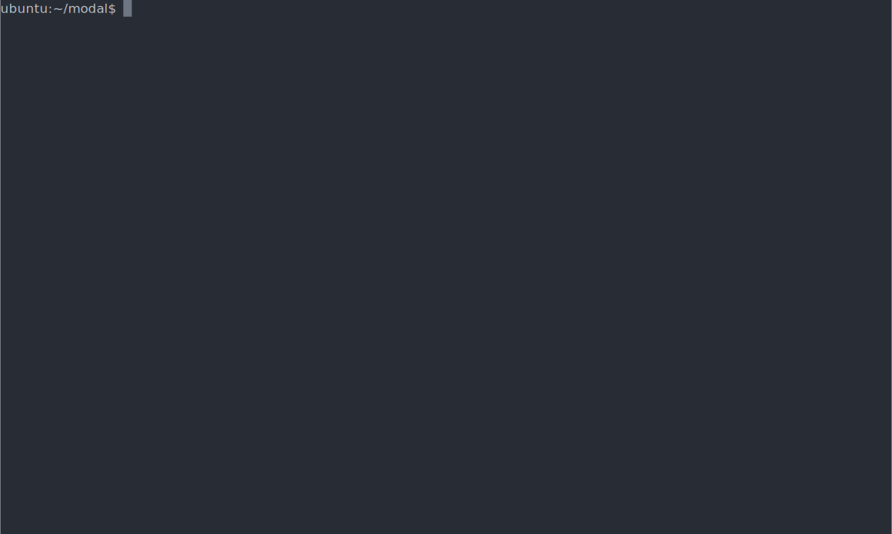
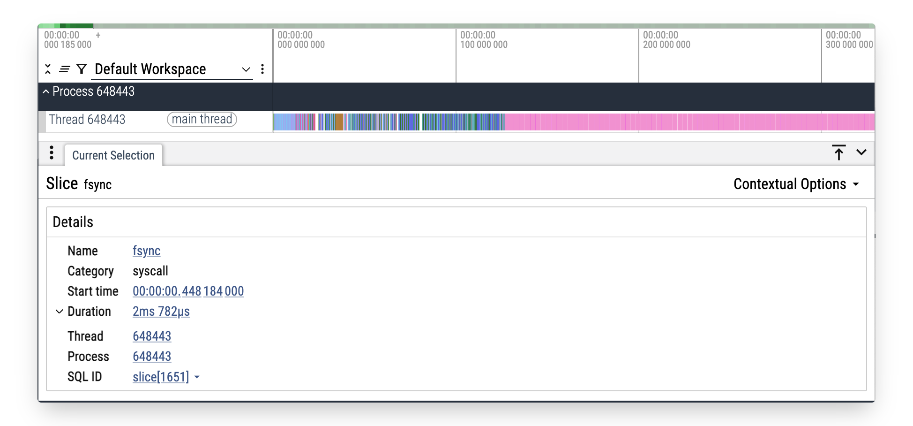
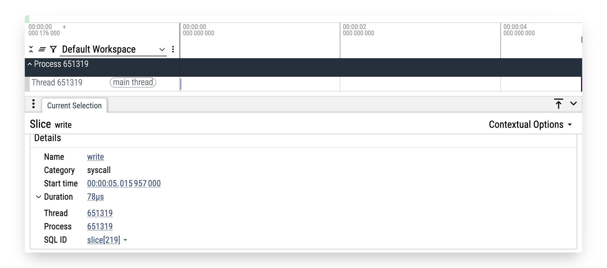

<p align="center">
  
</p>

<h1 align="center">rstrace</h1>


rstrace is a Rust implementation of `strace` for x86 Linux. It allows the user to trace system calls of a process or command.

Unlike `strace` it can introspect NVIDIA CUDA system calls.



## Install

> [!NOTE]
> Currently only x86 Linux is supported. aarch64 support is planned, but MacOS support is out-of-scope.

### Binary download

<!-- curl -LsSf https://raw.githubusercontent.com/thundergolfer/rstrace/refs/heads/main/scripts/install.sh | sh -->

```bash
curl -LsSf https://rstrace.xyz/install.sh | sh
```

### Cargo

`cargo install rstrace`

## Usage

```bash
rstrace ls /tmp/
```

To get a quick overview, use `rstrace --help`

```bash
Usage: rstrace [OPTIONS] [ARGS]...

Arguments:
  [ARGS]...  Arguments for the program to trace. e.g. 'ls /tmp/'

Options:
  -o, --output <OUTPUT>  send trace output to FILE instead of stderr
  -t, --timestamp...     Print absolute timestamp. -tt includes microseconds, -ttt uses UNIX timestamps
  -c, --summary-only     Count time, calls, and errors for each syscall and report summary
  -C, --summary          like -c, but also print the regular output
  -j, --summary-json     Count time, calls, and errors for each syscall and report summary in JSON format
      --tef              Emit Trace Event Format (TEF) trace data as output
      --verbose          Output human readable information about CUDA ioctls.
      --cuda             Enable CUDA ioctl sniffing. [Requires 'cuda_sniff' feature]
      --cuda-only        Enable CUDA ioctl sniffing and disable all other output. [Requires 'cuda_sniff' feature]
  -p, --attach <PID>     Attach to the process with the process ID pid and begin tracing.
  -f, --follow-forks     Trace child processes as they are created by currently traced processes as a result of the fork(2), vfork(2) and clone(2) system calls.
      --color            Enable colored output (default)
  -h, --help             Print help
  -V, --version          Print version
```

## cuda_sniff extension

`cuda_sniff` is an extension to `rstrace` that allows the user to trace CUDA API calls. It is based on
https://github.com/geohot/cuda_ioctl_sniffer by George Hotz.

`gvisor` has an alternative implementation called [ioct_sniffer](https://pkg.go.dev/gvisor.dev/gvisor/tools/ioctl_sniffer#section-readme) which uses `LD_PRELOAD` to intercept calls,
unlike `rstrace` which uses ptrace.

## Trace Event Format (TEF)

`rstrace` can emit basic tracing data which can be loaded into the Google [Perfetto](https://perfetto.dev/) trace viewer.

e.g. `rstrace --output in-kernel.tef.json --tef python userspace.py`

| Syscall dominant | Userspace dominant |
|--------|-----------|
|  |  |

<details>
<summary>Syscall heavy code snippet</summary>
<pre>
import os, time
deadline = time.monotonic() + 5
fd = os.open("tmp.bin", os.O_CREAT | os.O_RDWR, 0o600)
buf = b"\0" * 4096
while time.monotonic() < deadline:
    os.pwrite(fd, buf, 0)
    os.fsync(fd)
os.close(fd)</pre>
</details>

<details>
<summary>Userspace code snippet</summary>
<pre>use std::time::{Duration, Instant};
fn main() {
    let start = Instant::now();
    let mut x: u64 = 0;
    while start.elapsed() < Duration::from_secs(5) {
        for _ in 0..1_000_000 {
            // LCG-style math to burn CPU; wrapping avoids UB
            x = x.wrapping_mul(1664525).wrapping_add(1013904223);
        }
    }
    println!("{}", x); // prevents optimizing away the loop
}</pre>
</details>


## Alternatives

- https://github.com/JakWai01/lurk

- https://github.com/strace/strace

- https://github.com/bpftrace/bpftrace
    - [Don't use rstrace/strace in production](https://www.brendangregg.com/blog/2014-05-11/strace-wow-much-syscall.html). Where feasible use `bpftrace` which is a more powerful tracing tool with much lower overhead.
